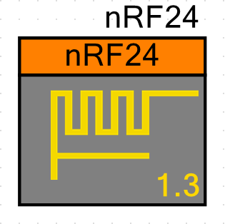

# nRF24 Component for PSoC4, PSoC5LP and PSoC6 (when available).

The SPI Master component, CS and CE pins nedeed to control the nRF24 chip must be provided by the user on the project schematic. This component only provide the functions to control the nRF24 radio.

Current version: 1.3

## TODO for version 1.2
- [x] PSoC 4.1 adds some features when implementing the custom component customizer, update the customizer.
- [x] If necessary write to all nRF24 registers in the x_init function, there are some missing initialization.

## TODO for version 1.3
- [x] Improve the SPI data transactions, reading bytes as they arrive to the RX FIFO, workaround for now is using the SPI component with a 38 bytes deep TX and RX FIFOs. - in test -.
- [ ] Update documentation.
- [ ] Finish the API.
- [ ] Component Datasheet.

## TODO
- [ ] PSoC6 support.
- [ ] Design a customizer using Visual Studio.

## PSoC6 support
With PSoC6 you can use the component and PDL APIs (see [PSoC6 Components and PDL](http://www.cypress.com/blog/psoc-creator-news-and-information/psoc-6-components-and-pdl-drivers)), given that PSoC6 is more like a PSoC4 on steroids, it might be "easy" to port code from PSoC4 to the PSoC6.
Tests for PSoC6 will be done when PSoC 4.1 and the PSoC6 are available.
