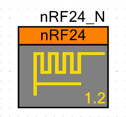

# nRF24 Component for PSoC4, PSoC5LP and PSoC6.

This component try to be usable on PSoC4, PSoC5LP and PSoC6 (when available).
The SPI, CS and CE pins necessary to control the nRF24 chip must be provided by the user on the project schematic. This means this component is software only.

With PSoC6 you can use the component and PDL APIs (see [PSoC6 Components and PDL](http://www.cypress.com/blog/psoc-creator-news-and-information/psoc-6-components-and-pdl-drivers)), given that PSoC6 is more like a PSoC4 on steroids, it might be "easy" to port code from PSoC4 to the PSoC6.
Tests for PSoC6 will be done when PSoC 4.1 and the PSoC6 are available.

Current version: 1.2

## TODO for version 1.0
- [x] Finish the component configuration tab on the customizer.
- [x] Check SCB SPI version, it fails on some transfers, (workaround) this was solved using a separated CS (chip select) pin, need to solve it to use the SS embedded into the SCB component.
- [x] Improve set and clear bit functions, on WriteBit function we can check if the bit is already set to the value we want.

## TODO for version 1.1
- [x] Check SCB SPI version, it fails on some transfers, (workaround) this was solved using a separated CS (chip select) pin, need to solve it to use the SS embedded into the SCB component.
- [x] Fix implementations on the IRQ handling functions.

## TODO for version 1.2
- [ ] PSoC 4.1 adds some features when implementing the custom component customizer, update the customizer.
- [ ] If necessary write to all nRF24 registers in the x_init function, there are some missing initialization.

## TODO
- [ ] Improve the SPI data transactions, reading bytes as they arrive to the RX FIFO, workaround for now is using the SPI component with a 38 bytes deep TX and RX FIFOs.
- [ ] Check PSoC6 implementation.
- [ ] Add a proper customizer using Visual Studio to design it.
