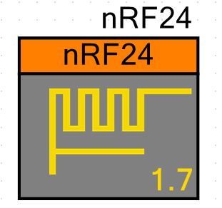

# nRF24 Component for PSoC4, PSoC5LP and PSoC6

The nRF24 component was initially developed as a personal project, so it can be improved, pull request are always welcome!.

The nRF24 radios communicate via SPI with their external controller, so it needs MISO, MOSI, SCLK and SS signals (for SPI communication), a digital output pin to control the CE pin and (the optional use of) a digital input pin for the IRQ pin to communicate interrupts to the controller.

This component use the SS (also known as CS or Chip Select) controlled via software to avoid problems with hardware-controlled SS pins, one problem solved with this is that now your SPI Master component can have any TX and RX FIFO depths.

The SPI Master component, SS, CE and IRQ (IRQ is optional) pins must be provided by the user on the project schematic. See the image below for an example.

## Example projects

See [nRF24 Example Projects](https://github.com/C47D/nRF24_Example_Projects) for basic example projects using this component!.

## How to use this component on your PSoC project?

You can directly clone this repo inside your project directory and update it as you want. After that you have to include it into your project dependencies.

If you want you can also include this repo as a git submodule.

## Current version: 1.7

The current component symbol is shown below:

The *customizer* or configuration window is where the PSoC Creator magic "happens", the custom *customizers* are ugly so i'm also trying to write a customizer in C# and add it to the component (Work in Progress), this is not really well documented and i'm pretty bad at desining GUI's so if you know C# and UI you can help me out.

The component configuration is separated in two tabs:

- nRF Configuration

In this tab all the configurable nRF24 registers are layed out, at the right of the window is a small description on each register field, it's better if you have a copy of the nRF24 datasheet at hand.

- Hardware Interface

In this tab the user need to provide the names of the SPI Master component used for communication with the nRF24 radio, the name of the pin used to control the SS (slave select) and the pin used to control the CE pin.

## TODO for version 1.7 [WiP]
- [ ] Component datasheet.
- [x] PSoC6 support (WiP, having problems with the PDL library).

## TODO for version 2.0
- [ ] API compatible with the nRF24 component of Erich Styger (mcuoneclipse)
- [ ] Design the customizer using Visual Studio.

## Coding style

The code style in the v2.0 will be similar to the [Linux kernel coding style](https://www.kernel.org/doc/html/v4.10/process/coding-style.html), for this the tool clang-format is used, the repo contains the .clang-format file.
