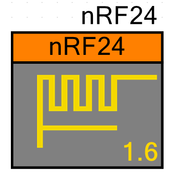
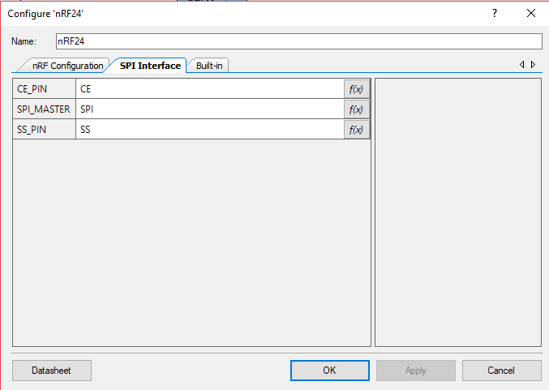

# nRF24 Component for PSoC4, PSoC5LP and PSoC6

The nRF24 component was initially developed as a personal project for an school assignmet, so it can be improved, pull request are always welcomed!.

The nRF24 radios can be interfaced using SPI and spare GPIOs. It needs MISO, MOSI, SCLK and SS pins for SPI communication with it's controller (a PSoC in this case), a digital output (MCU GPIO output) to control the CE pin and the optional use of the IRQ pin to communicate interrupts to the controller (so this pin is a MCU GPIO input).

The SS (also known as CS or Chip Select) pin of the component is controlled via software to avoid problems with hardware-controlled SS pins.

The component have portability between diferent PSoC devices in mind so the SPI Master component, SS, CE and IRQ pins must be provided by the user on the project schematic. See the image below for an example.

## Example projects

See  for multiple example projects using this component.

## Current version: 1.6

The component symbol is shown below:

The *customizer* or configuration window is separated in two tabs:
- nRF Configuration

- SPI Interface (TODO: Find a more appropiate name)

## TODO for version 1.6 [WiP]
- [ ] Update documentation.
- [ ] Component Datasheet.
- [x] PSoC6 support (WiP).

## TODO for version 2.0 [WiP]
- [ ] API compatible with the nRF24 component of Erich Styger (mcuoneclipse)
- [ ] Design the customizer using Visual Studio.

## Coding style [WiP]

The code style in the v2.0 will be similar to the , for this the tool clang-format is used, the repo contains the .clang-format file.
