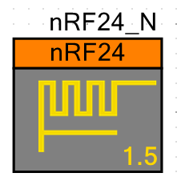

# nRF24 Component for PSoC4, PSoC5LP and PSoC6 (work in progress).

The SPI Master component, CS and CE pins needed to control the nRF24 chip must be provided by the user on the project schematic. This component only provide the functions to control the nRF24 radio.

See  for multiple example projects using this component.

Current version: 1.6

## TODO for version 1.6 [WiP]
- [ ] Update documentation.
- [ ] Component Datasheet.
- [x] PSoC6 support (WiP).

## TODO for version 2.0 [WiP]
- [ ] API compatible with the nRF24 component of Erich Styger (mcuoneclipse)

## TODO
- [ ] Design a customizer using Visual Studio.

## Code style [WiP]

The code style in the v2.0 will be similar to the , for this the tool clang-format is used, the repo contains the .clang-format file.
